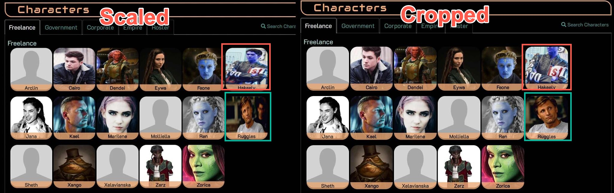

# Cropped Log Icons

The default log icon format makes the icon fit within the icon box.  While this ensures that the entire image is displayed, it can look a little squished.  An alternate icon format, contributed by skew@AresCentral, crops the icons instead. 

You can see the difference in the following image.  Notice how in the cropped version - Viggo's icon (in the teal box) looks better because extraneous background was cropped out, but the blue guy (in the orange box) got his head chopped off.

> Remember that players can always upload their own log icon image, separate from their main profile image, that's cropped the way they want it to be.  See `Help -> Game Help -> Web Icon` in your game's web portal.

    .log-icon {
        width: 150px;
        height: 150px;
        object-fit: cover;
        margin-left: auto;
        margin-right: auto;
        display: block;
    }

    .small-profile-icon {
        width: 50px;
        height: 50px;
        object-fit: cover;
        -moz-border-radius: 25px;
        -webkit-border-radius: 25px;
        border-radius: 25px;
        margin: 2px;
    }
