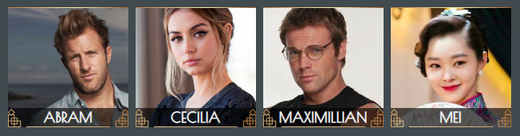
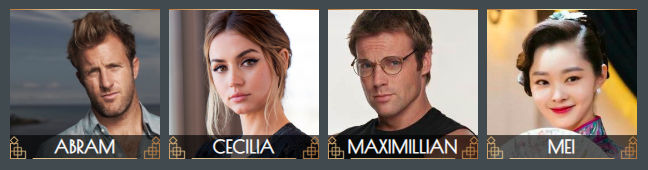

# Profile Icon Tweaks

### Cropping and Positioning

By default, if an image used as a Profile Icon is not exactly square, it gets squished to a 1:1 ration where it's displayed as 'small' (Active Scenes list, marking a pose in a live scene, etc.) or tiny (e.g., the character-choice dropdown in a live scene). On the Characters directory page, tall images are cropped, but wide ones are squished into the space.

#### Defaults:

 

Notice how Cecilia's image is vertically squished in the small icon, and Maximillian's is squished horizontally in both large and small icons. The CSS can be adjusted to always preserve the aspect ratio, but there is a trade-off here: portions that don't fit in the square will be cropped off. 

#### Cropped Only:

 

Note how none of the images are squished now, but that Cecilia is a bit high in the frame; on a really tall and thin image, her head might be cut off entirely. However, adding 'object-position', which determines where the image is anchored, can minimize that as an issue. Without it, the image window will be centered on the center of the image; as written in this CSS, the picture will be anchored at the center horizontally, and vertically, it will begin 10% into the image from the top. This seems to be about the sweet spot for a low incidence of any really odd croppings.

#### Cropped and positioned at center & 10%:

 

This creates a relatively pleasing arrangement for all the images. If someone's face is very low down on a tall, thin image, that probably won't look ideal, but it'll at least be almost identical to how it already looks in the default arrangement!

To make these changes, this CSS can be copied and pasted into 'Custom CSS Style' (a.k.a custom_style.scss) under 'Website' in 'Admin > Setup'.

    /* crop and position icons */
    .log-icon,
    .small-profile-icon,
    .tiny-profile-icon {
        object-fit: cover;
        object-position: center 10%;
    }
    .log-icon {
        width: 150px;
        height: 150px;
    }

### Small Icon Shaping

If you would prefer your small and tiny icons to be **squares with rounded corners**:

    /* small and tiny icons as round-cornered squares */
    .small-profile-icon,
    .tiny-profile-icon {
        border-radius: 4px;
    }
    
...or if you'd like them to be **squares with sharp corners**:

    /* small and tiny icons as sharp-cornered squares */
    .small-profile-icon,
    .tiny-profile-icon {
        border-radius: 0px;
    }

&mdash; Contributed by [Ren](https://arescentral.aresmush.com/handle/Ren)
