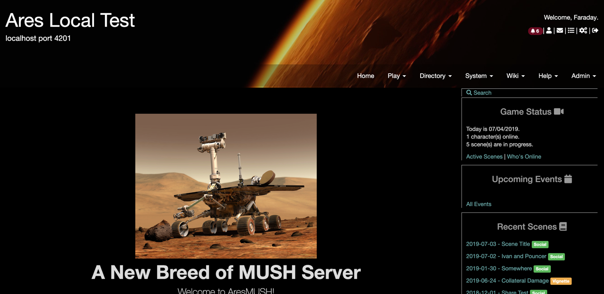
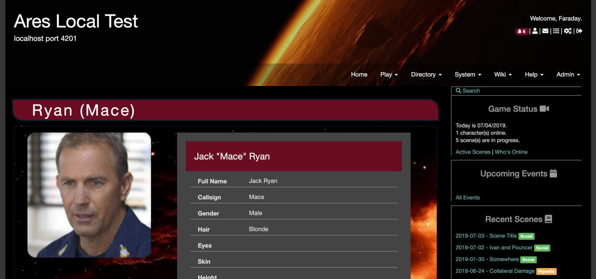

This is the default Ares theme modified to use a dark background.

## Installing

Use `theme/install ares-dark` with an admin character in-game.

> **Note:** Doing this will overwrite your current styles, colors, and theme images. They'll be backed up to the `aresmush/theme_archive` folder if you need to get them back.

## Screenshots

