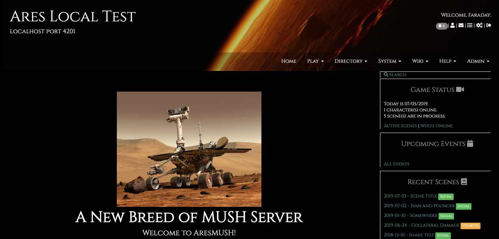

Dark theme contributed by g33kcub, with a black-and-gray motif and a fancier font.

## Installing

Use `theme/install g33kcub-dark` with an admin character in-game.

> **Note:** Doing this will overwrite your current web portal theme. The files will be backed up to the `aresmush/theme_archive` folder if you need to get them back.

## Screenshots

